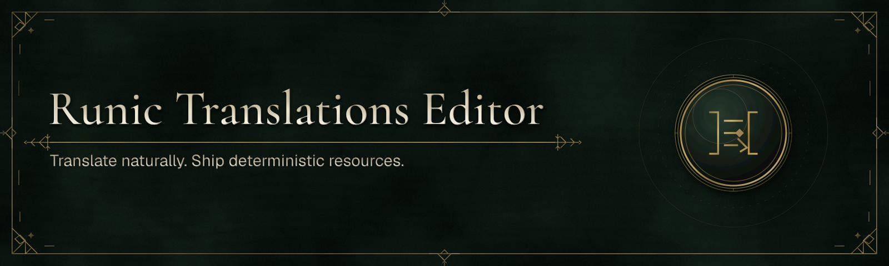

# Runic Translations Editor

Translate and review the same MessageFormat 2 project that application builds consume. Browse locale coverage, search messages, edit patterns and variables, preview changes, manage review state, and resolve compiler feedback in one place while keeping ordinary `.mf2` files readable in Git and any text editor.

Runic Translations Editor is a companion to [Runic Translations](../../packages/dotnet/Runic.Translations/README.md). The editor manages workspaces; the compiler, schema, runtime, CLI, and language integrations are published by the SDK.

## Availability and local commands

Standalone Editor distributions are outside the SDK preview. Build the editor from
source using the commands below. The examples here use the executable produced by
that build; no public download or signing status is implied.

Open the directory containing `translations/runic.json`, or the translations
directory itself. The editor uses the same compiler path as MSBuild and Vite.
Run `runic-translations-editor validate /path/to/workspace` for compiler-backed
validation: exit codes are `0` for valid, `1` for diagnostics or a missing project,
and `2` when validation cannot start.

## Headless interchange

Use `export` to write XLIFF or portable review JSON. Use `report` to inspect an import's reviewable diff and refusals without changing the workspace. An XLIFF import updates the target locale's conventional MF2 message files. An import is applied only when `--apply` is explicit; it previews and consumes the confirmation within one process, so no confirmation token is persisted or reusable.

```bash
./runic-translations-editor export /path/to/workspace --format xliff --output .runic-translations/export
./runic-translations-editor report /path/to/workspace --format xliff --source .runic-translations/export/catalog.en.xliff
./runic-translations-editor import /path/to/workspace --format xliff --source .runic-translations/export/catalog.en.xliff --apply

./runic-translations-editor export /path/to/workspace --format review --output .runic-translations/export/catalog.review.json
./runic-translations-editor report /path/to/workspace --format review --source .runic-translations/export/catalog.review.json
```

`--output` belongs to `export`; select the command response envelope with `--runic-output json` (or `RUNIC_COMMANDLINE_OUTPUT=json`). A report or import that is refused returns exit code `1` and lists its refusal codes in both human output and the JSON fault details.

## Local support diagnostics

Run `diagnostics <workspace>` to create the existing privacy-bounded diagnostic ZIP for an explicit local support collection. The command never uploads it. Use `dotnet runic support --mode preview|collect|remove --editor-diagnostics <zip> --destination <path>` to inspect, collect, or remove a local unsigned support envelope. The editor stores preferences, recents, and recovery drafts in one native per-user record, not a browser profile; it is atomically replaced and an unreadable record is quarantined on next launch. In the editor’s **About & diagnostics** panel, **Local editor state** reports only entry counts and bytes; use **Clear local state** to remove those records without changing workspace files or current in-memory work.

## What it supports

The editor opens conventional `runic.json` projects, validates and saves their
MF2 messages, watches external changes, and previews through the canonical
compiler model. Diagnostics remain privacy-bounded and writes use revision
checks plus atomic replacement.

Machine-translation providers and signed stable distribution are not available yet.

## Build from source

Use the shared SDK toolchain and run these commands from its root:

```sh
bun run bootstrap
bun run build
bun run dev:editor
```

All Runic dependencies resolve from source in the workspace. `bun run test` checks
the frontend, generated contract, editor save/recovery smoke and example workspace.
`bun run verify-packages` checks the SDK's isolated package consumers. See the
[contributor guide](../../CONTRIBUTING.md) for the complete verification sequence.

For frontend-only development, build once to generate the localized ESM module,
then run this from the SDK root:

```sh
RUNIC_TRANSLATIONS_MANIFEST="$PWD/apps/translations-editor/obj/Debug/net10.0/translations/editor.esm/web-module-manifest-v1.json" \
  bun run --cwd apps/translations-editor/Frontend dev:mock
```

Mock mode keeps writes in memory.

## Support and license

Report reproducible editor problems through [GitHub Issues](https://github.com/Runic-Artifex/runic-sdk/issues). Please include your platform, source revision and `--version` output, and safe-to-share validation output; do not include translation text or workspace paths in public reports.

Runic Translations Editor is released under the [MIT License](../../LICENSE). See [third-party notices](THIRD-PARTY-NOTICES.md) for bundled dependency notices.
