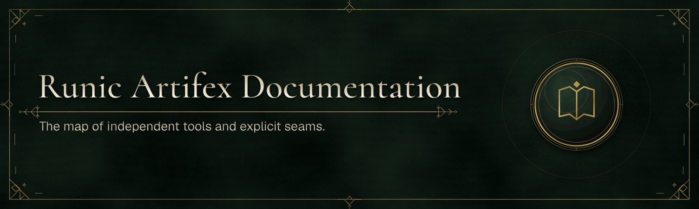

# Runic Artifex Documentation

Start at [docs.runic-artifex.eu](https://docs.runic-artifex.eu): choose a focused, open-source .NET tool, find its NuGet or npm package, and connect products only when your application needs the integration.

Runic Artifex tools work independently. The documentation helps you select the right starting point for a native desktop host, a desktop-and-browser application, asset delivery, localization, or a NativeAOT command-line application.

## Find the right starting point

- [Getting started](https://docs.runic-artifex.eu/getting-started) maps common application goals to a product.
- [Products](https://docs.runic-artifex.eu/products) explains capabilities, boundaries, and official integrations.
- [Packages](https://docs.runic-artifex.eu/packages) is the NuGet and npm catalog, including install commands.
- [Application Bridge](https://docs.runic-artifex.eu/application-bridge) explains how Runic Toolkit connects frontend and .NET application contracts.
- [Release status](https://docs.runic-artifex.eu/releases) shows what is available today.

Release, package, compatibility, and migration status are generated from the shared release authority. A version remains explicitly unassigned until the authority records it as published; the documentation never infers package availability from repository state.

Versioned [Runic Translations JSON Schemas](https://docs.runic-artifex.eu/schemas/translations/) are also published as static assets. Their canonical identifiers use the `runic-artifex.eu` origin and resolve to the documentation host.

## Contribute

Documentation corrections, examples, and product guidance are welcome. Please [open an issue](https://github.com/Runic-Artifex/runic-docs/issues) to discuss a substantial change, then submit a focused [pull request](https://github.com/Runic-Artifex/runic-docs/pulls). Product-specific bugs and feature requests belong in the linked product repository from the relevant documentation page.

### Develop locally

This site requires Node.js 24 and npm.

```bash
npm ci
npm run dev
```

Vite prints the local URL, normally `http://localhost:5173`.

Before opening a pull request, run:

```bash
npm run lint
npm run check
npm test
```

`npm test` builds the static site and checks key rendered routes, catalog entries, and release information.

### Release authority data

Release data is generated from the sibling `Runic-Artifex/.github` authority;
it is not copied into a hand-maintained catalog. In the shared workspace the
default manifest is `../.github/runic.release.json`:

```bash
npm run generate:release-data
npm run check:release-data
```

For a standalone clone, check out the authority at the same immutable commit
recorded by `RUNIC_RELEASE_AUTHORITY_REVISION`, then pass its manifest path:

```bash
git clone https://github.com/Runic-Artifex/.github.git release-authority
export RUNIC_RELEASE_AUTHORITY_REVISION="$(node --input-type=module -e 'import { authorityRevision } from "./scripts/release-authority.mjs"; console.log(authorityRevision)')"
git -C release-authority checkout "$RUNIC_RELEASE_AUTHORITY_REVISION"
RUNIC_RELEASE_MANIFEST=release-authority/runic.release.json \
  npm test
```

The environment variable applies to `npm run generate:release-data`,
`npm run check:release-data`, and the full `npm test` verification.

The docs workflow uses that pinned revision for the manifest, schema, and
verifier together. Publish the authority revision first; then update the one
docs pin, regenerate `src/lib/generated/release-data.ts`, and submit both
changes. Do not point the generator or CI at a mutable branch.

## How the site is published

The documentation portal is a SvelteKit and Svelte 5 site, prerendered with `@sveltejs/adapter-static` and served at [docs.runic-artifex.eu](https://docs.runic-artifex.eu). The separate `runic-site` repository owns the project landing page at [runic-artifex.eu](https://runic-artifex.eu).

## Maintainer release notes

Keep the public catalog aligned with verified registry artifacts and their install commands. Before a product preview is announced, verify the exact source revision, package identity, version, documentation links, and supported NuGet/npm publishing path. Publish through the protected, trusted-publisher workflow; do not treat this portal’s source repository as a package registry.

The site build is emitted to `build/` and prerendered for deployment. Production builds use `RUNIC_SITE_ORIGIN=https://docs.runic-artifex.eu`; no Node.js dependencies are installed at runtime. The canonical translation-schema identifiers remain on the apex origin and are routed to the static schema files from this repository.

## License and support

The portal source and documentation are licensed under the [MIT License](LICENSE). For documentation support, use the [issue tracker](https://github.com/Runic-Artifex/runic-docs/issues); for package support, use the relevant product repository linked from the live documentation.
